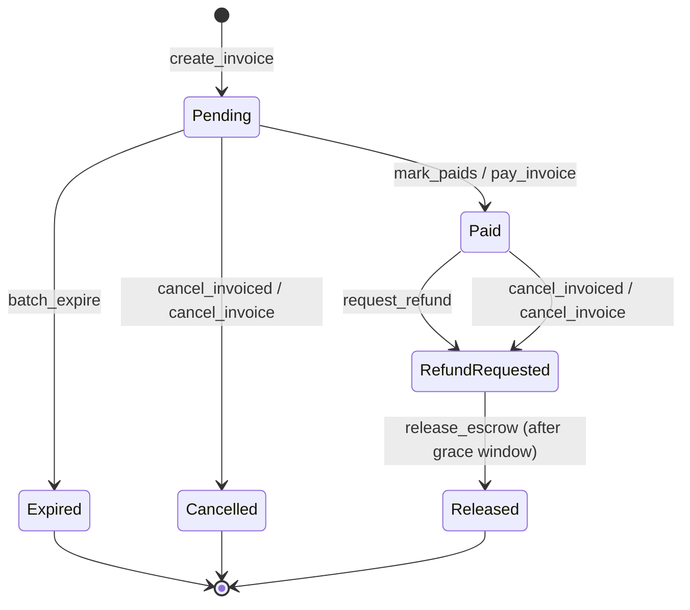

# Architecture

This repository sits at the centre of the COMEBACKHERE protocol and orchestrates three sibling projects:

- **Smart contracts** — Soroban contracts (`invoice`, `treasury`, `compliance`).
- **Backend API** — Node/Express service that fronts the contracts.
- **Frontend UI** — React/Vite app used by merchants, payers, and admins.

Each layer has **two source trees in this repository**, plus CI jobs that pull a third copy from upstream. This document explains which tree to target when contributing.

## Canonical trees (where changes go)

The active source of truth for each layer lives in a tree with the `COMEBACKHERE-` prefix inside this repository:

| Layer | Canonical tree | Why |
| --- | --- | --- |
| Contracts (Rust) | `COMEBACKHERE-contracts/` | `cargo test --manifest-path COMEBACKHERE-contracts/Cargo.toml` is run by `make test` and by `.github/workflows/ci-contracts.yml`. ABI snapshots in `abis/` are generated from this workspace. |
| Backend (Node) | `comebackhere-backend/` | Referenced by `.github/workflows/ci.yml` for `npm ci`, `tsc --noEmit`, `npm run lint`, `npm run build`. |
| Frontend (React) | `comebackhere-frontend/` | Same as backend — the `ci.yml` `working-directory` points here. |

New feature work, bug fixes, and contract changes should target these three directories by default — they're the only ones with a dedicated, contract-specific CI workflow.

## Mirrored trees (older in-tree copies)

The repository also contains a parallel set of directories without the prefix:

- `contracts/` and `backend/` and `frontend/`

These are in-tree copies of the canonical sources at earlier points in time. They are kept because:

- Process docs reference them by path. `docs/error-codes.md` calls out `contracts/invoice/src/lib.rs` as the source of `InvoiceError`; that file still lives here.
- They give reviewers a familiar path while the migration to the `COMEBACKHERE-*` trees completes.

These trees are valid PR targets, but they have a **gap in coverage**: only the `ci-*.yml` workflows that match their files run on a PR touching them. There is no independent `cargo test` for `contracts/Cargo.toml` or `backend/Cargo.toml`, and no independent frontend build for `frontend/`. So a green PR here will not, by itself, prove the change works against the toolchain pinned in the canonical workspace.

If your change is brand-new work, target the `COMEBACKHERE-*` tree to inherit full CI coverage. If your change is intentionally narrow (a doc tweak, a small Rust fix in a file the CI happens to cover), the mirrored tree is fine.

## CI checkout behaviour

Some CI workflows re-check the canonical trees out from upstream rather than using the in-tree copies:

- `ci-contracts.yml`, `ci-abi-snapshots.yml`, `ci-abi-metadata.yml`, `ci-post-deploy-verify.yml`, and `ci-coverage.yml` do `actions/checkout` of `WHEELBACK/COMEBACKHERE-contracts` into the local `COMEBACKHERE-contracts/` path.
- The local `COMEBACKHERE-contracts/` checkout in this repository exists so that `make update-abi-snapshots` and `scripts/check_abi_snapshot_hygiene.sh` work locally without a separate clone.
- A consumer running on a developer's machine can equivalently clone `COMEBACKHERE-contracts` as a sibling directory; `scripts/generate_abi_metadata.sh` looks for both locations.

## Other top-level paths

- `abis/` — committed ABI metadata (`invoice.json`, `treasury.json`, `compliance.json`). Generated from `COMEBACKHERE-contracts/` via `make update-abi-snapshots`.
- `scripts/` — Bash + Python helpers for ABI generation, snapshot hygiene, deployment, and backend env validation.
- `docs/` — error codes, API reference, deployment guides, the ABI snapshot workflow, and other process docs.
- `.github/workflows/` — CI jobs.

## Local development layout

A working clone for end-to-end development looks like this (see `docs/dev-environment.md` for full setup):

```text
~/comebackhere/
  ├── COMEBACKHERE-contracts/   # canonical contracts
  ├── COMEBACKHERE/             # this repository
  ├── comebackhere-backend/     # canonical backend
  └── comebackhere-frontend/    # canonical frontend
```

When working inside this repository alone, the in-tree `COMEBACKHERE-contracts/` checkout acts as the canonical contracts tree; the sibling-clone step is optional for backend/frontend contributors.

## Invoice state machine

The invoice contract (`COMEBACKHERE-contracts/contracts/invoice/src/lib.rs`, mirrored at `contracts/invoice/src/lib.rs`) is the source of truth every other layer reads from: backend status displays, the indexer, and both frontend apps all ultimately derive their view of an invoice from this state machine. The diagram below shows every `InvoiceStatus` value and the function whose call transitions an invoice into it. Any transition not shown here is illegal and the calling function returns an `InvalidStateTransition` / `NotPending` style error (see [docs/error-codes.md](docs/error-codes.md) for the exact variant and code per contract).



Notes on edges that are deliberately absent from this diagram:

- **`Paid` is never re-entered.** Once an invoice leaves `Pending`, no function transitions it back to `Paid`. In particular, `mark_paids` guards against being called on an invoice that is `RefundRequested`, `Released`, `Cancelled`, or `Expired`, so a stale or replayed payment confirmation can never silently override a refund already in progress.
- **`RefundRequested`, `Released`, `Cancelled`, and `Expired` are terminal with respect to payment and cancellation** — `cancel_invoiced`, `request_refund`, and `mark_paids` all reject calls made once an invoice has reached one of these states.
- **`release_escrow` is time-gated**, not just state-gated: it additionally requires `ledger.timestamp() >= invoice.created_at + grace_window`.

## Further reading

- [docs/dev-environment.md](docs/dev-environment.md) — full local setup.
- [docs/abi-snapshot-workflow.md](docs/abi-snapshot-workflow.md) — when and how to regenerate `abis/`.
- [docs/adr-0001-dual-source-trees.md](docs/adr-0001-dual-source-trees.md) — why the dual source trees exist.
- [docs/adr-0002-dual-tree-removal-plan.md](docs/adr-0002-dual-tree-removal-plan.md) — concrete milestones and timeline for removing mirrored trees.
- [docs/error-codes.md](docs/error-codes.md) — contract error enums and their meanings.
- [SECURITY.md](SECURITY.md) — which paths handle fund-safety-critical code.
